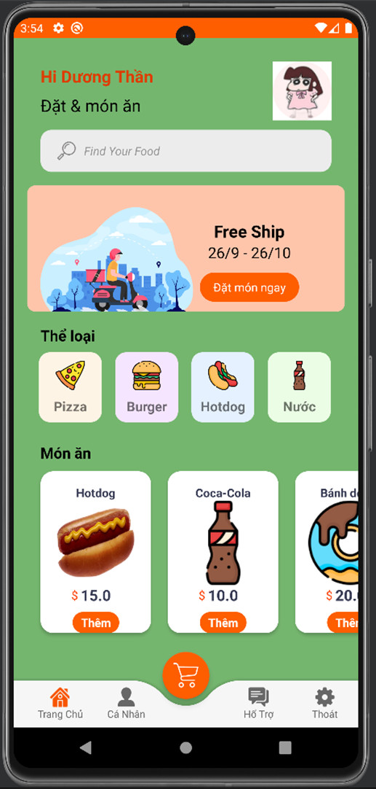
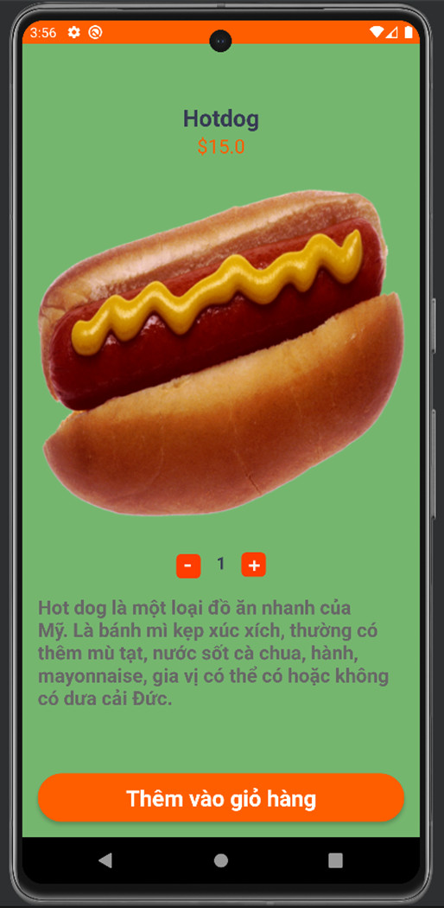
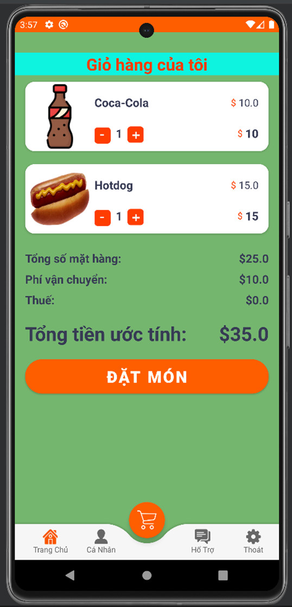
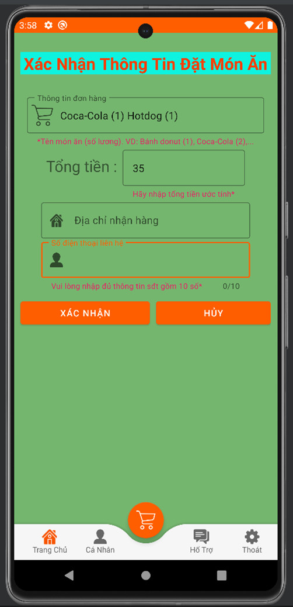
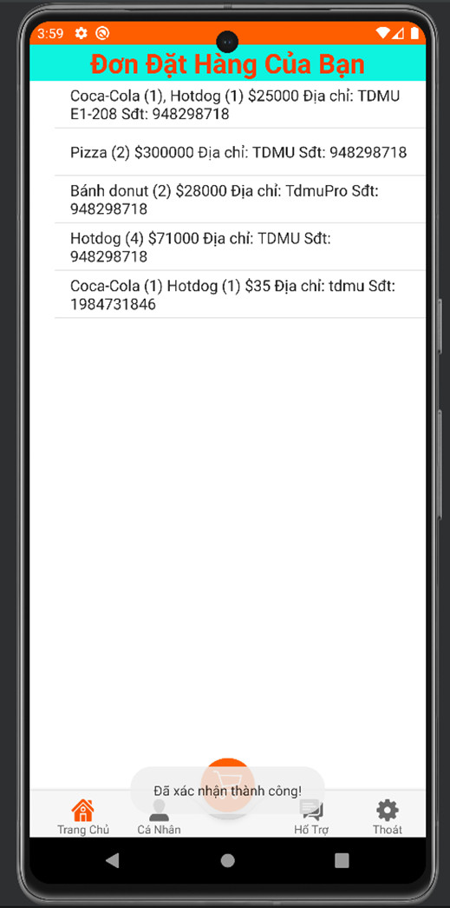

# Demo foodorderapp
## 1. Màn hình Mở đầu

Mô tả màn hình:
Đây là mở đầu cho ứng dụng. Việc thiết kế giao diện mở đầu cho ứng dụng đẹp cũng sẽ giúp 1 phần nào đó trong việc cải thiện thiện cảm cho người dùng trong việc sử dụng ứng dụng.

## 2. Màn hình Trang chủ

Mô tả màn hình:
Đây là trang chủ của ứng dụng và cũng như nơi để thực hiện các thao tác khác trên ứng dụng, ở trang giao diện này ta có thể thấy một số thông tin như các hình ảnh món ăn với giá tiền và ta có thể chọn lựa để mua, ta có thể xem thấy tên và hình ảnh của người dùng, tìm kiếm món ăn và một số chức năng khác như cá nhân để xem theo dõi đơn hàng đã xác nhận, hổ trợ và thoát ứng dụng sau khi sử dụng.

## 3. Màn hình Chọn đồ ăn

Mô tả màn hình:
Đây là nơi để chúng ta có thể chọn những món ăn, những loại ẩm thực mà chúng ta thích và đặt nó vào trong giỏ hàng, ở trang màn hình này ta có thể thấy một số thông tin như giá cả món ăn, hình ảnh tượng trưng cho món ăn, một số mô tả để khách hàng có thể hiểu rõ hơn về món ăn và ngoài ra ta có thể chọn số lượng món ăn mà ta muốn mua và bấm thêm vào giỏ hàng. 

## 4. Màn hình Giỏ hàng

Mô tả màn hình:
Đây là nơi mà chúng ta theo dõi những món ăn mà ta đã thêm vào giỏ hàng trước đó, và ta có thể xem được tổng tiền cho những mặt hàng mà chúng ta đã chọn để tiện lợi cho việc thanh toán tiếp theo, ngoài ra ta có thể chỉnh sửa số lượng món ăn trong giỏ hàng.

## 5. Màn hình Xác nhận thông tin

Mô tả màn hình:
Sau khi ta nhấn vào đặt món thì ta sẽ được chuyển từ giao diện giỏ hàng đến giao diện xác nhận để ta có thể xác nhận thông tin trước khi xác nhận đặt món. Ở giao diện này ta sẽ chỉ nhập 2 thông tin đó là địa chỉ để nhận hàng và số điện thoại để nhân viên cửa hàng có thể xác nhận lại. Đây là nơi để giúp chúng ta xác nhận lại được thông tin của người dùng để khi có người giao hàng hay hóa đơn hoặc bất cứ thứ gì thì cũng sẽ có minh chứng và thông tin của người đặt hàng. 

## 6. Màn hình Theo dõi đơn hàng

Mô tả màn hình:
Và sau khi đã xác nhận thông tin đơn hàng thành công thì dữ liệu sẽ được lưu lại cơ sở dữ liệu, người dùng sẽ được thông báo đã xác nhận thành công và người dùng cũng đồng thời được đưa đến trang cá nhân để xem lại việc xác nhận thông tin đơn hàng khi nãy. Đây là nơi để giúp chúng ta xác nhận lại chính xác những đơn hàng nào mà chúng ta đã đặt.

